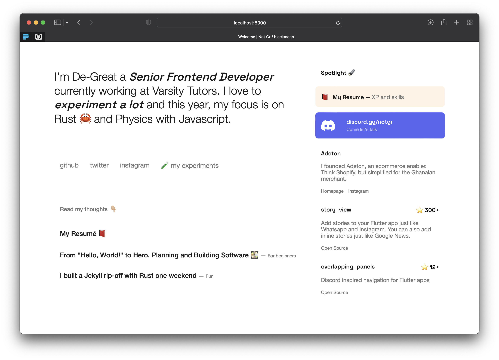

# The home 🏠 I'm finally sticking with

I have settled for this simplified but carefully crafted homepage for myself. I built a custom generator you can locate at `tools/myjekyllripoff` (written in Rust 🦀) to allow templating and quick content creation.

Visit home here: 🌍 [degreat.co.uk](https://degreat.co.uk)

> 💾 Hosting powered by [Github Pages](https://pages.github.com)